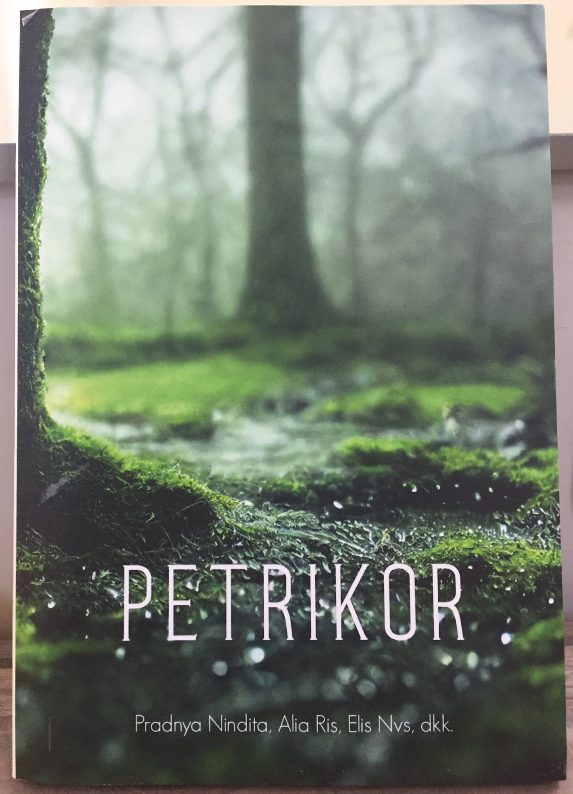

# Ms.Ancila's Profile

Welcome, good people!

I am Ancila Putri Perwitasari. People call me Ms.Ancila or Ms.Cila. I studied in Jogjakarta for my bachelor's degree and in Jakarta for a master's degree; both are in English Language and Education Study Program. I majored in literature since I love reading, mainly Asian novels.

My teaching career started in the sprawling metropolis Jakarta for one year. For more challenges and experience teaching abroad, I offed to Thailand for two years. My golden age was over, and I returned to my lovely country, Indonesia. I taught in Jakarta again for two years. I decided to leave the metropolis and move to Surakarta, my dream city, to spend my life with my family.

I love traveling, and I was a solo traveler. Being a solo traveler taught me to be  an independent and a problem solver. I spent my time reading a novel on my journey because sometimes there was no signal in the place I visited. Visiting historical sites is my favorite because history is important to know who we are. Snorkeling is my hobby to see how great God's creatures underwater, such as corals, fish species, and other sea life. Besides, dancing traditional dances is a way to recharge my energy. Life is learning and sharing. It makes me love learning something new. Being a teacher is my way of sharing everything with others, and I hope it is meaningful.

## Favorite Books

